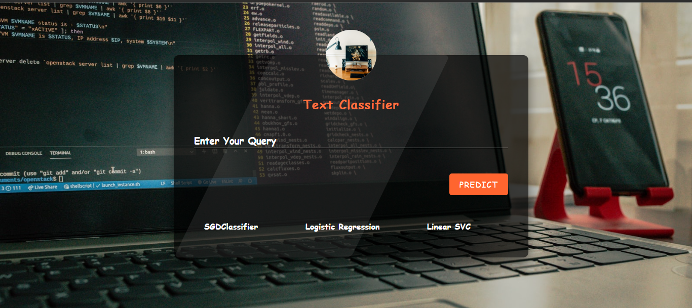

# Stack Overflow Tag Suggestion System

## Overview
> This repository contains a Stack Overflow tag suggestion system that utilizes a text classification model to predict relevant tags for questions. The system is designed to suggest relevant tags for Stack Overflow questions using a text classification model. The model analyzes textual descriptions of questions and predicts multiple labels associated with each question. The underlying dataset is derived from the "StackSample: 10% of Stack Overflow Q&A" dataset.

 This repository contains a Stack Overflow tag suggestion system that utilizes a text classification model to predict relevant tags for questions. The system is designed to suggest relevant tags for Stack Overflow questions using a text classification model. The model analyzes textual descriptions of questions and predicts multiple labels associated with each question. The underlying dataset is derived from the "StackSample: 10% of Stack Overflow Q&A" dataset. 

 

  Additionally, a web-based application has been developed using Flask and HTML/CSS to provide a user-friendly interface for utilizing the trained model.

 

The project is organized into two main components: `main.py` for data preprocessing, text vectorization, tag label encoding, and model training, and `app.py` for the web-based application.

## GUI

## `main.py` - Model Training 

### Features Implemented

1. **Text Preprocessing:**

    The system performs comprehensive text preprocessing on the input/loaded data, including data cleaning, removing duplicated and null values, tokenization, and removal of stop words, enhancing the quality of the textual information.
2. **Text Vectorization:**

      To facilitate the processing of textual data, the system employs TF-IDF vectorization, converting text data into a numerical format that can be used by machine learning models.
3. **Tag Label Encoding:**
   
   The tag labels associated with the Stack Overflow questions are encoded using the MultilabelBinarizer, a crucial step for training the multi-label classification model.
4. **Splitting Data for Training and Testing:**

   The dataset has been partitioned into training and testing sets to facilitate model training and evaluation, adhering to standard practices in machine learning.
5. **Model Selection:**
   
    Several classical classifiers are implemented for modeling, and their performances are compared. The following algorithms were employed:
      - Multinomial & Gaussian Naive Bayes
      - K-Nearest Neighbors (KNN)
      - Decision Tree
      - Stochastic Gradient Descent (SGD)
      - Logistic Regression
      - Linear Support Vector Classification (Linear SVC)

### Results
   - The system reports high accuracy scores for the Stochastic Gradient Descent (SGD), Logistic Regression, and Linear Support Vector Classification (Linear SVC) models. These algorithms demonstrate superior performance in predicting relevant tags for Stack Overflow questions.

### Usage
  - Ensure you have the necessary dependencies installed. (List dependencies in a `requirements.txt` file, if applicable.)
   - Run `main.py` to perform all of the above steps.

## `app.py` - Web-Based Application

### Features Implemented
1. **Flask Web Application:**
    
      A Flask web application provides a user interface for interacting with the trained models.
2. **Real-time Predictions:**
 
    Users can input a question, and the application will predict relevant tags using the trained models (SGDClassifier, LogisticRegression, LinearSVC).

### Usage
- Ensure you have the necessary dependencies installed. (List dependencies in a `requirements.txt` file, if applicable.)
- Run `app.py` to start the Flask web application.
- Access the application through a web browser and input a question to receive tag suggestions.

## File & Folder Structure 
- `data/`: Contain the "StackSample: 10% of Stack Overflow Q&A" dataset.
- `train_models/`: Directory containing the trained models (`SGDClassifier.pkl`, `LogisticRegression.pkl`, `LinearSVC.pkl`).
- `main.py`: Contains the code for data preprocessing, text vectorization, tag tag label encoding, and model training.
- `app.py`: Contains the Flask application code for the web-based system.
- `static/` and `templates/`: Contain static files (CSS) and HTML templates for the web application.
- `requirements.txt`: Includes the necessary dependencies to install.
